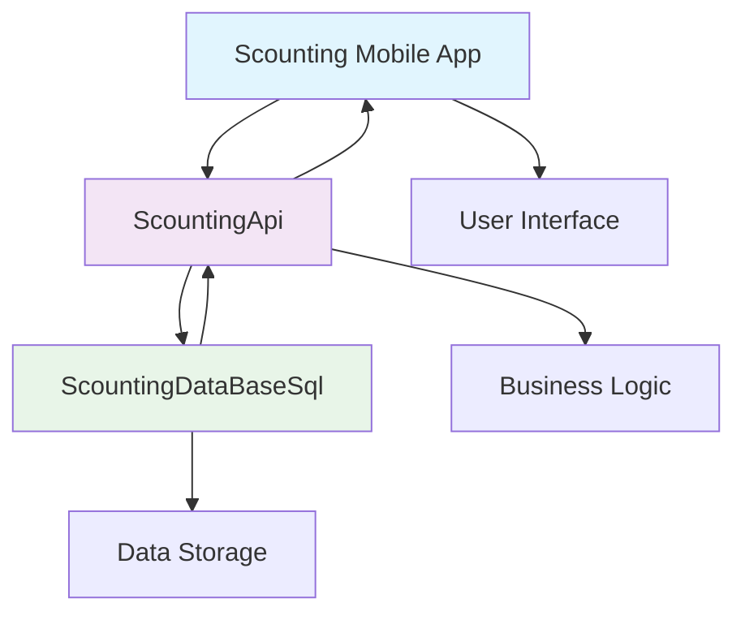

<div align="center">

# 🚀 OL-Sergio's Development Portfolio

[](https://github.com/OL-sergio)
[](https://developer.android.com/)
[](https://www.java.com/)
[](https://firebase.google.com/)

*A comprehensive collection of mobile applications and collaborative systems showcasing modern development practices*

---

</div>

## 📋 Table of Contents

- [🎯 Portfolio Overview](#-portfolio-overview)
- [📱 Featured Application: Uber Clone](#-featured-application-uber-clone)
- [🌟 Application Portfolio](#-application-portfolio)
- [🤝 Collaborative Systems](#-collaborative-systems)
- [🛠️ Technology Stack](#️-technology-stack)
- [🚀 Getting Started](#-getting-started)
- [📞 Contact & Support](#-contact--support)

---

## 🎯 Portfolio Overview

Welcome to my development portfolio! This repository showcases a diverse range of applications and systems, from ride-sharing platforms to collaborative scouting solutions. Each project demonstrates different aspects of modern mobile and web development.

### 🌟 Highlights
- **📱 Mobile Applications**: Native Android apps with modern UI/UX
- **🔥 Firebase Integration**: Real-time databases and authentication
- **🗺️ Location Services**: GPS tracking and mapping functionality
- **🤝 Collaborative Systems**: Integrated multi-service architectures
- **🎨 Visual Design**: Material Design and custom UI components

---

## 📱 Featured Application: Uber Clone

<div align="center">

### 🚗 Uber Clone - Ride Sharing Platform

*An Android application that replicates the core functionality of Uber, providing a platform for ride-sharing services with separate interfaces for passengers and drivers.*

[](link-to-apk)
[](link-to-demo)

</div>

### ✨ Key Features

<div align="center">

| 👥 **For Passengers** | 🚗 **For Drivers** | 🔧 **System Features** |
|:---------------------|:-------------------|:----------------------|
| 🚗 Request rides with real-time tracking | 🚙 Accept/decline ride requests | 🔐 Secure authentication system |
| 📍 Set pickup & destination via Maps | 🗺️ Navigate to pickup locations | 👤 Role-based user interface |
| 💰 View trip costs & payment info | 📊 View passenger & trip details | 🌍 Real-time location tracking |
| 🔍 Track driver & arrival time | 💳 Process payments & complete trips | 🗣️ Multi-language support |
| 📱 Cancel rides when needed | 📍 Share location with passengers | 🔄 Live status updates |

</div>

### 🛠️ Technology Stack

<div align="center">


</div>

| Component | Technology | Purpose |
|-----------|------------|---------|
| **Platform** | Android (API 26+) | Native mobile application |
| **Language** | Java 8 | Core development language |
| **Build System** | Gradle with Kotlin DSL | Project automation |
| **Database** | Firebase Realtime Database & Firestore | Data persistence |
| **Authentication** | Firebase Authentication | User management |
| **Maps** | Google Maps Android API | Location services |
| **Location Services** | GeoFire | Real-time location queries |
| **UI Framework** | Material Design Components | Modern interface design |

### 🚀 Quick Start Guide

<details>
<summary><b>🔧 Setup Instructions</b></summary>

#### 1. Clone the Repository
```bash
git clone https://github.com/OL-sergio/Uber_clone.git
cd Uber_clone
```

#### 2. Firebase Configuration
1. Create a new project in [Firebase Console](https://console.firebase.google.com/)
2. Enable Authentication, Realtime Database, and Firestore
3. Download the `google-services.json` file
4. Place it in the `app/` directory

#### 3. Google Maps API Setup
1. Go to [Google Cloud Console](https://console.cloud.google.com/)
2. Enable Maps SDK for Android
3. Create an API key
4. Update the API key in `AndroidManifest.xml`:
```xml
<meta-data
    android:name="com.google.android.geo.API_KEY"
    android:value="YOUR_API_KEY_HERE" />
```

#### 4. Build and Run
1. Open the project in Android Studio
2. Sync the project with Gradle files
3. Connect an Android device or start an emulator
4. Run the application

</details>

<details>
<summary><b>📁 Project Structure</b></summary>

```
app/
├── src/
│   ├── main/
│   │   ├── java/udemy/java/uber_clone/
│   │   │   ├── activity/          # All app activities
│   │   │   │   ├── MainActivity.java
│   │   │   │   ├── LoginActivity.java
│   │   │   │   ├── RegisterActivity.java
│   │   │   │   ├── PassengerActivity.java
│   │   │   │   ├── DriverActivity.java
│   │   │   │   └── RequestsActivity.java
│   │   │   ├── config/            # Firebase configuration
│   │   │   ├── helpers/           # Utility classes
│   │   │   └── model/             # Data models
│   │   ├── res/                   # Resources (layouts, strings, etc.)
│   │   └── AndroidManifest.xml
│   └── test/                      # Unit tests
└── build.gradle.kts               # App-level build configuration
```

</details>

<details>
<summary><b>📱 Usage Guide</b></summary>

#### Getting Started
1. **Launch the app** and choose your role (Passenger or Driver)
2. **Create an account** or login with existing credentials
3. **Grant location permissions** when prompted

#### As a Passenger
1. Set your pickup location (current location by default)
2. Enter your destination
3. Request a ride by tapping "Chamar Uber"
4. Wait for a driver to accept your request
5. Track your driver's location in real-time
6. Complete the trip and view payment details

#### As a Driver
1. Wait for ride requests in the "RequestsActivity"
2. View incoming requests with passenger details
3. Accept a ride request
4. Navigate to the passenger's location
5. Pick up the passenger and navigate to destination
6. Complete the trip and process payment

</details>

<details>
<summary><b>📦 Key Dependencies</b></summary>

```kotlin
// Firebase Services
implementation 'com.google.firebase:firebase-auth'
implementation 'com.google.firebase:firebase-database'
implementation 'com.google.firebase:firebase-firestore'

// Google Services
implementation 'com.google.android.gms:play-services-maps'
implementation 'com.google.android.gms:play-services-location'

// Location Services
implementation 'com.firebase:geofire-android'

// Android UI Components
implementation 'androidx.appcompat:appcompat'
implementation 'com.google.android.material:material'
implementation 'androidx.constraintlayout:constraintlayout'
```

</details>

---

## Contributing

1. Fork the repository
2. Create a feature branch (`git checkout -b feature/amazing-feature`)
3. Commit your changes (`git commit -m 'Add some amazing feature'`)
4. Push to the branch (`git push origin feature/amazing-feature`)
5. Open a Pull Request

---

## 🌟 Application Portfolio

<div align="center">

*A diverse collection of applications showcasing different domains and technologies*

</div>

### 🍕 iFood Clone
> **Food Delivery Platform**

[](https://github.com/OL-sergio/iFood)
[](https://developer.android.com/)

A comprehensive food delivery application inspired by iFood, featuring restaurant listings, menu browsing, order management, and real-time delivery tracking.

**Key Features:**
- 🍽️ Restaurant discovery and browsing
- 📱 Interactive menu with customization options
- 🛒 Shopping cart and order management
- 📍 Real-time delivery tracking
- 💳 Multiple payment methods integration

---

### 🌤️ YupWeather
> **Weather Forecast Application**

[](https://github.com/OL-sergio/YupWeather)
[](https://openweathermap.org/)

A beautiful weather application providing accurate forecasts with an intuitive interface and location-based weather updates.

**Key Features:**
- 🌡️ Current weather conditions and forecasts
- 📍 Location-based weather detection
- 📊 Weather charts and historical data
- 🌙 Day/night mode interface
- ⚡ Weather alerts and notifications

---

### 💬 Instagra-chat
> **Social Media Chat Platform**

[](https://github.com/OL-sergio/Instagra-chat)
[](https://socket.io/)

An Instagram-inspired social chat application with photo sharing, real-time messaging, and social networking features.

**Key Features:**
- 📸 Photo sharing with filters and effects
- 💬 Real-time messaging and chat rooms
- 👥 User profiles and social connections
- ❤️ Like, comment, and sharing system
- 📱 Stories and status updates

---

### 🐦 Flappybird
> **Classic Game Implementation**

[](https://github.com/OL-sergio/Flappybird)
[](https://developer.android.com/games)

A classic Flappy Bird game implementation with smooth animations, scoring system, and engaging gameplay mechanics.

**Key Features:**
- 🎮 Intuitive tap-to-fly controls
- 🏆 High score tracking and leaderboards
- 🎵 Sound effects and background music
- 🌈 Colorful graphics and animations
- 📊 Game statistics and achievements

---

### ✅ Tasks
> **Task Management Application**

[](https://github.com/OL-sergio/Tasks)
[](https://todoist.com/)

A comprehensive task management application for organizing daily activities, setting reminders, and tracking productivity.

**Key Features:**
- ✏️ Create, edit, and organize tasks
- 📅 Calendar integration and scheduling
- 🔔 Smart notifications and reminders
- 📊 Progress tracking and analytics
- 🏷️ Categories and priority management

---

### 🏥 MedUtent
> **Medical Utility Application**

[](https://github.com/OL-sergio/MedUtent)
[](https://www.who.int/)

A medical utility application providing health tracking, medication reminders, and medical information management.

**Key Features:**
- 💊 Medication tracking and reminders
- 📋 Health records and history
- 🏥 Doctor appointments scheduling
- 📊 Health metrics and charts
- 🚨 Emergency contact integration

---

### 🎨 MiniPaint
> **Digital Painting Application**

[](https://github.com/OL-sergio/MiniPaint)
[](https://www.adobe.com/)

A lightweight digital painting and drawing application with various brushes, colors, and creative tools.

**Key Features:**
- 🖌️ Multiple brush types and sizes
- 🎨 Color palette and custom colors
- 📐 Drawing tools and shapes
- 💾 Save and export artwork
- ↩️ Undo/redo functionality

---

### 🛒 OLX Clone
> **Marketplace Platform**

[](https://github.com/OL-sergio/OLX)
[](https://www.shopify.com/)

A marketplace application inspired by OLX, enabling users to buy and sell products with advanced search and filtering capabilities.

**Key Features:**
- 🏪 Product listings and browsing
- 🔍 Advanced search and filters
- 💬 In-app messaging system
- 📸 Photo upload and gallery
- 💰 Price negotiation features

---

## 🤝 Collaborative Systems

<div align="center">

*Integrated multi-service architecture for comprehensive scouting solutions*

</div>

### 🔍 Scouting Ecosystem

A comprehensive scouting platform consisting of three interconnected applications working together to provide a complete solution for talent identification and management.

<div align="center">



</div>

#### 📱 Scounting
> **Main Scouting Application**

[](https://github.com/OL-sergio/Scounting)
[](https://developer.android.com/)

The primary mobile application providing intuitive interfaces for scouts, coaches, and administrators to manage talent identification processes.

**Key Features:**
- 👥 Scout and player profile management
- 📊 Performance analytics and reports
- 📍 Location-based scouting events
- 📱 Real-time data synchronization
- 🎯 Advanced search and filtering

---

#### 🌐 ScountingApi
> **REST API Service**

[](https://github.com/OL-sergio/ScountingApi)
[](https://fastapi.tiangolo.com/)

A robust REST API service handling all business logic, authentication, and data processing for the scouting ecosystem.

**Key Features:**
- 🔐 Secure authentication and authorization
- 📡 RESTful API endpoints
- 🔄 Real-time data processing
- 📊 Analytics and reporting engine
- 🛡️ Data validation and security

---

#### 🗄️ ScountingDataBaseSql
> **Database Layer**

[](https://github.com/OL-sergio/ScountingDataBaseSql)
[](https://www.postgresql.org/)

Comprehensive database design and management system providing optimized data storage and retrieval for the scouting platform.

**Key Features:**
- 🗃️ Optimized database schema design
- 📈 Performance tuning and indexing
- 🔄 Data migration and versioning
- 🛡️ Backup and recovery procedures
- 📊 Database analytics and monitoring

### 🔗 System Integration

The three applications work seamlessly together:

1. **Scounting** provides the user interface and mobile experience
2. **ScountingApi** handles all business logic and API communication
3. **ScountingDataBaseSql** manages data persistence and retrieval

This architecture ensures scalability, maintainability, and optimal performance across the entire scouting ecosystem.

---

## 🛠️ Technology Stack

<div align="center">

*Technologies and frameworks used across the portfolio*

</div>

### 📱 Mobile Development


### 🔥 Backend & Cloud


### 🗄️ Database


### 🎨 UI/UX


### 🌐 APIs & Services


---

## 🚀 Getting Started

### 📋 Prerequisites

Before running any application, ensure you have:

- **Android Studio** (latest version)
- **Java 8+** or **Kotlin** support
- **Google Maps API Key** (for location-based apps)
- **Firebase Project** with required services
- **Android SDK** (minimum API level varies by project)

### 🔧 Quick Setup

1. **Clone any repository:**
   ```bash
   git clone https://github.com/OL-sergio/[repository-name].git
   cd [repository-name]
   ```

2. **Configure Firebase:**
   - Create Firebase project
   - Download `google-services.json`
   - Place in `app/` directory

3. **Setup API Keys:**
   - Configure required API keys in `AndroidManifest.xml`
   - Update configuration files as needed

4. **Build and Run:**
   ```bash
   ./gradlew build
   ./gradlew installDebug
   ```

### 📚 Detailed Setup

Each repository contains specific setup instructions in its individual README file. Please refer to the respective documentation for detailed configuration steps.

---

## 📞 Contact & Support

<div align="center">

### 👨‍💻 OL-Sergio

[](https://github.com/OL-sergio)
[](https://github.com/OL-sergio)
[](mailto:contact@example.com)

*Passionate mobile developer creating innovative solutions*

</div>

### 🤝 Contributing

Contributions are welcome across all projects! Please feel free to:

- 🐛 Report bugs and issues
- 💡 Suggest new features
- 🔀 Submit pull requests
- ⭐ Star repositories you find useful

### 📄 License

Individual projects may have different licenses. Please check each repository for specific license information.

### 🔒 Security Note

⚠️ **Important**: All API keys shown in public repositories are examples only. Replace with your own keys for production use.

---

<div align="center">

### 🌟 Thanks for visiting!

*This portfolio showcases various projects developed for educational and demonstration purposes. Each application represents different aspects of modern mobile and web development.*

[](#-ol-sergios-development-portfolio)

</div>